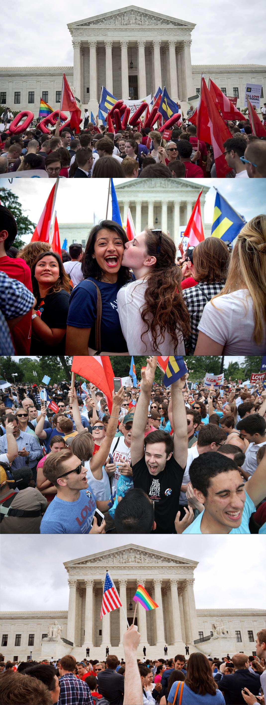
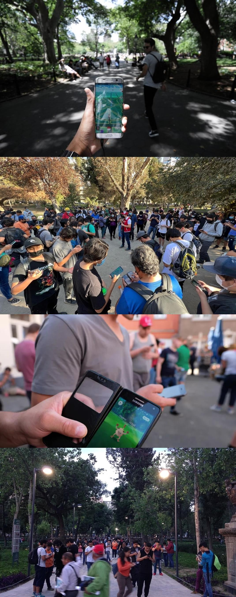

# US News Events Study

- Selected six public events between 2014 and 2017

- Participants in the *No-Photo* condition read brief descriptions of the events and rated how far away the events felt
- Participants in the *Photo* condition read the same descriptions and viewed four photos of each event, and rated how far away the events felt

## Nationwide legalization of same-sex marriage (SM)

2015-06-26

The U.S. Supreme Court struck down all state bans on same-sex marriage, legalized it in all fifty states, and required states to honor out-of-state same-sex marriage licenses in the case Obergefell v. Hodges.

## The Ferguson unrest (FU)

2014-08-10

The Ferguson unrest, which involved protests and riots, started after the fatal shooting of Michael Brown by police officer Darren Wilson in Ferguson, Missouri.

## The Las Vegas mass shooting (LV)

2017-10-01

A gunman unleashed a rapid-fire barrage of bullets from the 32nd floor of a Las Vegas hotel, killing at least 59 people and injuring more than 500 others attending a country music festival. 

## Robin Williams dies (RW)

2014-08-11

Robin Williams, actor and comedian, was found dead at age 63.

 

## Pokémon Go Mania (PG)

2016-08

The augmented reality mobile game Pokémon Go experienced a surge in popularity global wide, creating the “Pokémon Go Mania”. 

 

## Donald Trump announced his presidential campaign (DT)

2015-06-16 

Donald Trump announced his presidential campaign to a crowd of supporters at Trump Tower in New York City.

